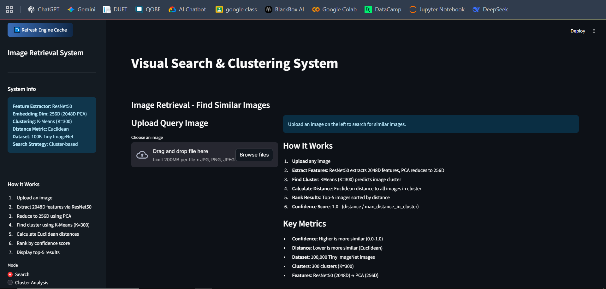
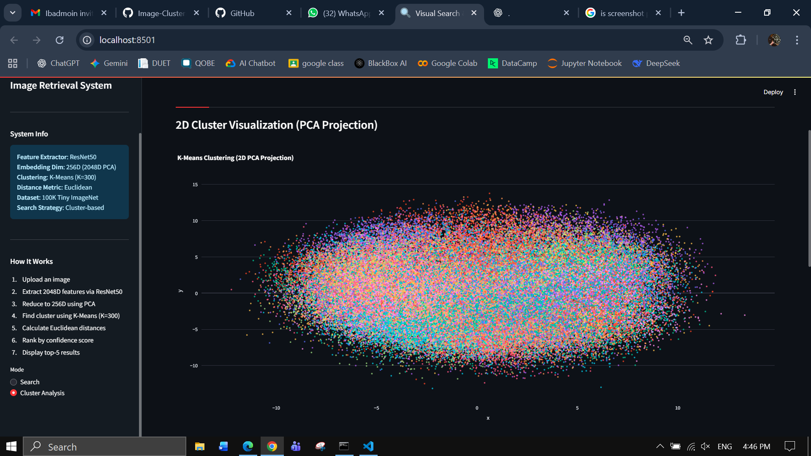
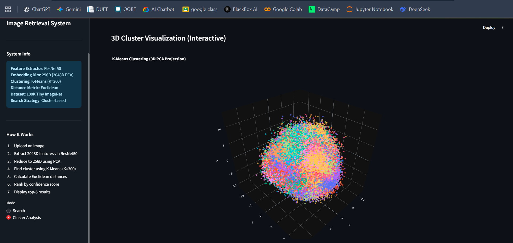

# Image Clustering & Retrieval System

## 📋 Project Overview

This project implements an intelligent **Image Clustering and Retrieval System** using machine learning techniques. The system leverages deep neural networks to extract image embeddings, cluster similar images together, and provide efficient retrieval of visually similar images from a large dataset.

### Key Features

- **Image Embedding Extraction**: Uses pre-trained deep learning models to generate high-dimensional image embeddings
- **Clustering**: Groups similar images using advanced clustering algorithms
- **Similarity Search**: Efficiently retrieves images similar to a query image
- **Interactive Web Interface**: Built with Streamlit for easy visualization and interaction
- **Scalable Architecture**: Handles large image datasets with optimized processing

### Use Cases

- Visual search applications
- Content-based image retrieval
- Image deduplication
- Photo organization and categorization
- E-commerce product discovery

---

## 🚀 Getting Started

### Prerequisites

- Python 3.8 or higher
- pip (Python package installer)
- Virtual environment support

### Installation & Setup

#### Step 1: Clone the Repository

```bash
git clone https://github.com/Ibadmoin/Image-Clustering-Retrieval-System.git
cd Image-Clustering-Retrieval-System
```

#### Step 2: Create and Activate Virtual Environment

**On Windows (PowerShell):**
```powershell
python -m venv venv
.\venv\Scripts\Activate.ps1
```

**On macOS/Linux:**
```bash
python3 -m venv venv
source venv/bin/activate
```

#### Step 3: Install Required Dependencies

```bash
pip install -r requirements.txt
```

#### Step 4: Download and Extract the Training Data

The system requires the Tiny ImageNet 200 dataset to function properly for retrieving similar images.

1. Download the Tiny ImageNet 200 dataset from: http://cs231n.stanford.edu/tiny-imagenet-200.zip
2. Extract the compressed file
3. Copy the `train` folder to the `data` directory:
   ```
   data/
   ├── train/
   │   ├── n01443537/
   │   ├── n01629819/
   │   └── ... (other class folders)
   └── (other data files)
   ```

#### Step 5: Run the Application


1. Start the Streamlit application:
   ```bash
   streamlit run app/main.py
   ```

3. The application will open in your default browser at `http://localhost:8501`

---

## 📁 Project Structure

```
MLSEMProj/
├── app/
│   ├── main.py                 # Streamlit application entry point
│   ├── ui_components.py        # UI components and styling
│   └── styles.css              # CSS styling
├── src/
│   ├── inference.py            # Inference pipeline
│   ├── utils.py                # Utility functions
│   ├── extract_images.py       # Data extraction utilities
│   └── verify_inference.py     # Verification scripts
├── data/
│   ├── train/                  # Tiny ImageNet 200 training data (to be downloaded)
│   ├── embeddings.npy          # Pre-computed image embeddings
│   ├── cluster_labels.npy      # Cluster labels
│   └── filenames.json          # Mapping of filenames
├── notebooks/
│   ├── colab_training.ipynb    # Google Colab training notebook
│   └── Copy_of_ML(clustering).ipynb  # Clustering experiments
├── requirements.txt            # Python dependencies
└── readme.md                   # This file
```

---

## 🔧 Usage

### Starting the Application

1. Ensure your virtual environment is activated:
   ```powershell
   .\venv\Scripts\Activate.ps1  # Windows
   # or
   source venv/bin/activate     # macOS/Linux
   ```

2. Run the Streamlit app:
   ```bash
   streamlit run app/main.py
   ```

3. Open your browser and navigate to the provided local URL (typically `http://localhost:8501`)

### Using the Interface

- **Upload Image**: Upload an image to find similar images in the dataset
- **View Results**: Browse through clustered images and similarity scores
- **Adjust Parameters**: Tune clustering parameters and similarity thresholds

---

## 📸 Screenshots

Here are some screenshots of the application in action:

### Home Page


### Image Upload & Search Results
.png)
.png)

### Clustering Visualization



---

## 🎥 Demo Video

Watch a complete demo of the Image Clustering & Retrieval System:

[)](https://drive.google.com/file/d/1-PueAQOrQ68UqHC_JYtvyx22S5SXMKRR/view)

**[Click here to watch the demo video](https://youtu.be/3HU4hSOFNjY)**

---

## 📦 Dependencies

Key dependencies used in this project:

- **TensorFlow/PyTorch**: Deep learning framework for model inference
- **NumPy**: Numerical computations
- **Streamlit**: Web interface framework
- **Scikit-learn**: Machine learning utilities and clustering algorithms
- **PIL/OpenCV**: Image processing
- **Pandas**: Data manipulation and analysis

For a complete list, see `requirements.txt`

---

## 🔍 How It Works

1. **Feature Extraction**: Images are processed through a pre-trained deep neural network to extract high-dimensional embeddings
2. **Clustering**: Similar embeddings are grouped using clustering algorithms (e.g., K-means)
3. **Indexing**: Embeddings are indexed for fast similarity search
4. **Retrieval**: For a query image, the system finds the most similar images using distance metrics (e.g., cosine similarity)

---

## 🤝 Contributors

This is a group project developed by:

<a href="https://github.com/Ibadmoin/Image-Clustering-Retrieval-System/graphs/contributors">
  
</a>

<a href="https://github.com/KhuzaimaIrfan">
  
</a>

---


## ✉️ Contact

For questions or suggestions, please reach out to the project maintainer:
- **GitHub**: [Ibadmoin](https://github.com/Ibadmoin)
- **GitHub**: [KhuzaimaIrfan](https://github.com/KhuzaimaIrfan/)


---

## 🙏 Acknowledgments

- Tiny ImageNet dataset
- Open-source machine learning community
- Contributors and users who provide feedback

---

**Last Updated**: January 2026
